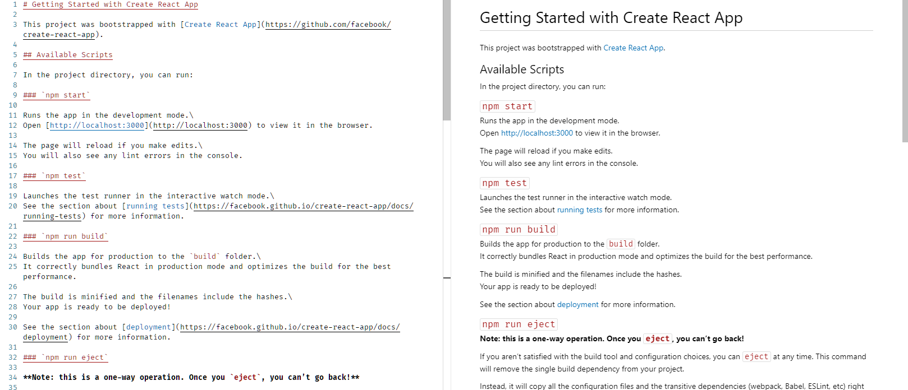

# Newbie Light Color Theme

This color theme was inspired by code snippets from [Habr](https://habr.com/).
I liked the `#F18A2B`, `#8757A5` and `#4370B0` colors and thought, they'd look nice as a simple standalone light theme.

Btw, I also added custom styling to the Markdown Preview, so that everything looks a bit more consistent.

## How it looks with Python

## How it looks with Markdown

## How it looks with SCSS

## How it looks with HTML

## How it looks with Rust

## How it looks with C++

**Enjoy!**
